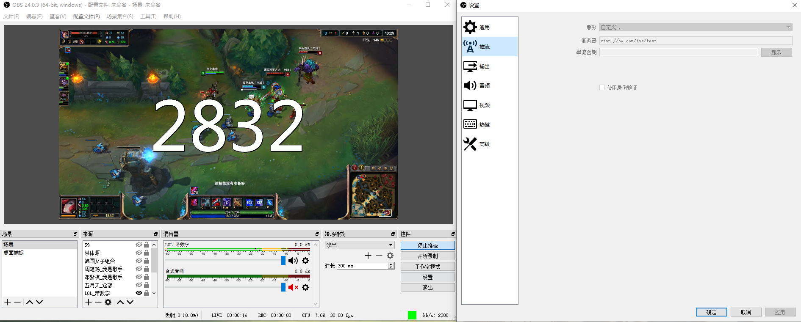
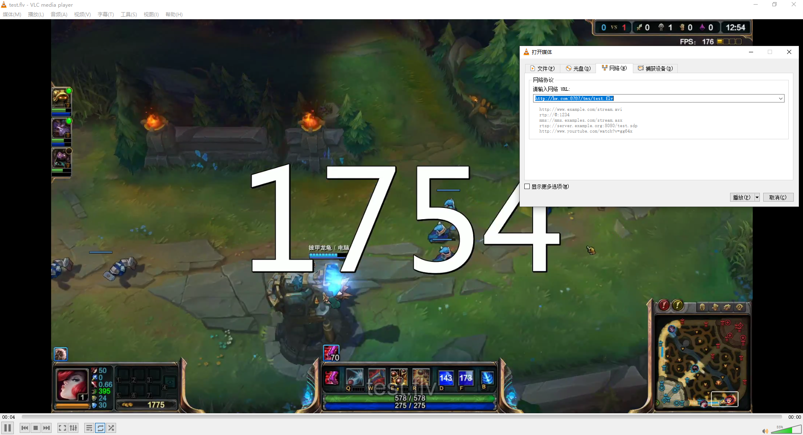
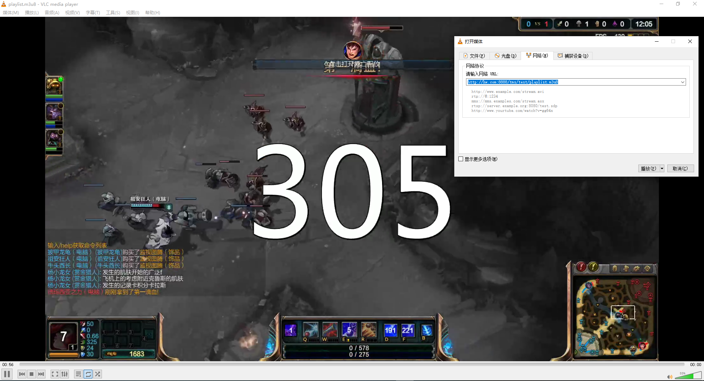
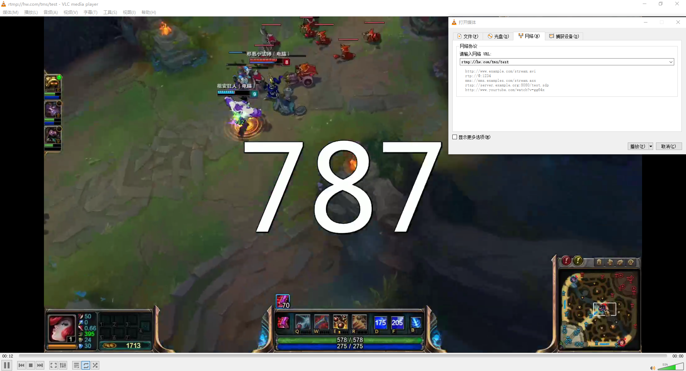
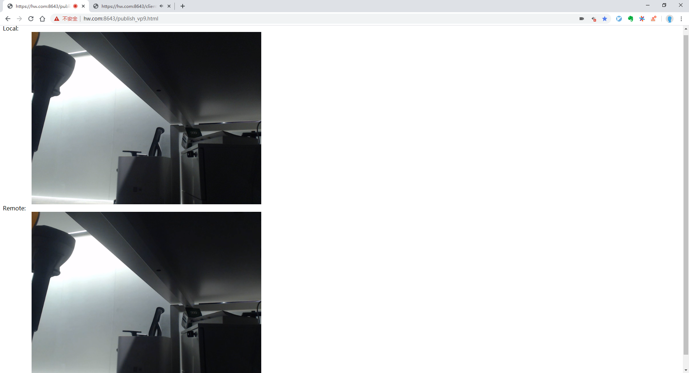
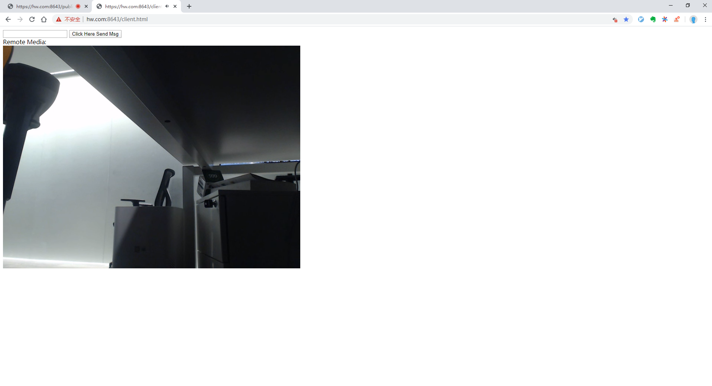

## tms

tms(toy media server) is a toy media server for myself learning media develop.

## Feature
- [x] publish media by rtmp
- [x] publish media by webrtc
- [x] publish media by srt
- [x] plya media by rtmp
- [x] play media by http-flv
- [x] play media by http-hls
- [x] play media by webrtc
- [x] play media by srt
- [x] media demux/remux, like rtmp(flv) to webrtc(rtp)
- [ ] transcode
- [ ] MCU
- [ ] media server forward, current tms is only a single server node

## Todo
- sdp generater and sdp parser, instead of hardcode xxx.sdp
- WebRTC adapt to different version of chrome
- WebRTC adapt to different video encoder
- friendly API

## Bugs
There are many bugs in WebRTC, because the complexity.

## Usage

**Step 1:** get source code
```
git clone https://github.com/HuyaJohn/tms.git
cd tms
```

**Step 2:** fetch depend
```
cd depend
./depend.sh
```

**Step 3:** build
```
cd ../src
make
```
**Step 4:** run
```
./tms -server_ip xxx.xxx.xxx.xxx
```

## Example

### 1. publish rtmp using obs, play flv/hls/rtmp using vlc

publish rtmp using obs, I use host "hw.com" to hide my server ip for safety.
# 

play http-flv using vlc
# 

play hls using vlc
# 

play rtmp using vlc
# 

### 2. publish using chrome(WebRTC), play using chrome(WebRTC)
chrome publish vp9, I use host "hw.com" to hide my server ip for safety, and it's hardcode in sdp.
# 

chrome play vp9
# 
